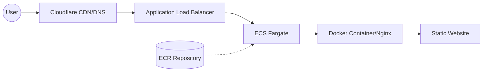

# Portfolio Website Infrastructure Design

## Overview
This document outlines the infrastructure design for a containerized portfolio website deployed on AWS using modern cloud technologies and CDN services.

## Architecture Diagram


## Components Breakdown

### Domain and CDN Layer
- **Domain Registrar**: Porkbun
- **CDN/DNS Provider**: Cloudflare
  - Free tier
  - SSL/TLS termination
  - DNS management
  - CDN caching

### AWS Infrastructure

#### Container Registry
- **Service**: Amazon Elastic Container Registry (ECR)
- **Repository**: `portfolio-website`
- **Region**: us-east-1
- **Tagging Strategy**: Semantic versioning (e.g., v1.0.0)

#### Container Orchestration
- **Service**: Amazon ECS with Fargate
- **Cluster**: `portfolio-cluster`
- **Service Name**: `portfolio-service`
- **Task Definition**: `portfolio-task`
- **Launch Type**: FARGATE (Serverless)

#### Networking
- **Load Balancer**: Application Load Balancer
- **Target Group**: `portfolio-targets`
- **Security Group**: `portfolio-sg`
  - Inbound Rules:
    - HTTP (80) from Cloudflare
    - HTTPS (443) from Cloudflare

#### IAM & Security
- **Task Execution Role**: `ecsTaskExecutionRole`
- **Permissions**:
  - ECR image pull
  - CloudWatch logs
  - Task execution

### Application Stack
- **Base Image**: Nginx Alpine
- **Web Server**: Nginx
- **Content**: Static files (HTML, CSS, JavaScript)
- **Container Port**: 80

## Deployment Workflow

1. **Local Development**
   ```bash
   # Build Docker image
   docker build -t portfolio-website:latest .
   
   # Tag image for ECR
   docker tag portfolio-website:latest [AWS_ACCOUNT_ID].dkr.ecr.us-east-1.amazonaws.com/portfolio-website:v1.0.0
   ```

2. **Image Push**
   ```bash
   # Authenticate with ECR
   aws ecr get-login-password --region us-east-1 | docker login --username AWS --password-stdin [AWS_ACCOUNT_ID].dkr.ecr.us-east-1.amazonaws.com
   
   # Push image
   docker push [AWS_ACCOUNT_ID].dkr.ecr.us-east-1.amazonaws.com/portfolio-website:v1.0.0
   ```

3. **ECS Deployment**
   - Update task definition with new image tag
   - Register new task definition version
   - Update ECS service to use new task definition
   - Force new deployment

## Monitoring & Logging

- **Service Metrics**: CloudWatch
  - Container insights
  - ECS service metrics
  - ALB metrics
- **Logs**: CloudWatch Logs
  - Container logs
  - ECS task logs

## Cost Optimization

- Fargate Spot can be considered for cost reduction
- Cloudflare free tier for CDN and DNS
- ECR lifecycle policies to clean old images
- Right-sizing Fargate task CPU/Memory

## Security Considerations

1. **Edge Security**
   - Cloudflare WAF (optional paid feature)
   - SSL/TLS encryption
   - DDoS protection

2. **AWS Security**
   - Security groups limit access
   - IAM roles follow least privilege
   - Private subnets for ECS tasks
   - Regular security patches via new container builds

## Backup & Disaster Recovery

- Website code version controlled (Git)
- Container images versioned in ECR
- Infrastructure as Code recommended for AWS resources
- Multi-AZ deployment in ECS for high availability